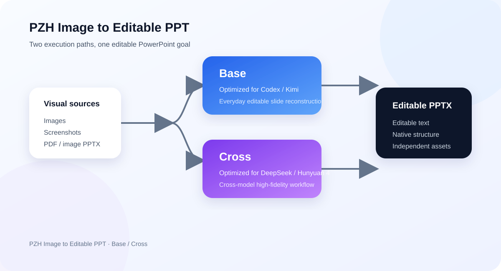

# PZH Image to Editable PPT

> Turn images, screenshots, scanned PDFs, and image-based PPTX pages into editable PowerPoint presentations.



PZH Image to Editable PPT is a two-edition Agent Skill family for rebuilding visual slide sources into editable `.pptx` files. Both editions retain the complete reconstruction capability and work chain. Base adds model-specific optimization for GPT, Kimi K3, and Claude, while Cross focuses on compatibility with DeepSeek V4.1, GLM 5.3, Tencent Hunyuan 4, and other domestic models.

## Choose an edition

| Edition | Model direction | Main positioning | Practical result |
| --- | --- | --- | --- |
| **Base** | GPT series, Kimi K3, and Claude | Full capability and full work chain with model-specific efficiency optimization | In the current benchmark scope, more than 60% faster and about 50% lower quota consumption, with the same output boundary |
| **Cross** | DeepSeek V4.1, GLM 5.3, Tencent Hunyuan 4, and other domestic models | Full-chain compatibility edition for complex reconstruction tasks | Preserves the complete analysis, rebuild, render review, and delivery-validation chain |

The two editions share the same capability foundation. Base prioritizes speed and quota efficiency on GPT, Kimi K3, and Claude; Cross prioritizes full-chain compatibility on DeepSeek V4.1, GLM 5.3, Tencent Hunyuan 4, and similar model environments.

## Base

Use **Base** when you want the complete reconstruction capability with a faster, more quota-efficient execution path on GPT, Kimi K3, or Claude.

Base keeps the complete capability set and work chain of the Cross edition. It adds targeted instructions, planning shortcuts, context control, and model-specific execution adjustments for GPT, Kimi K3, and Claude. In the current benchmark scope, the optimized path improved execution speed by more than 60% and reduced quota consumption by about 50%.

It is a good fit for:

- business cards and information panels;
- process diagrams and simple flowcharts;
- tables and regular data pages;
- single-page screenshots;
- pages that need editable text, cards, connectors, and common icons.

Base keeps the same core chain: inspect the page, build an editable object plan, generate the PPTX, review the rendered result, and apply focused corrections. The optimization changes how efficiently the chain runs on the target models; it does not remove the core reconstruction capability.

## Cross

Use **Cross** when you need the complete work chain to run on DeepSeek V4.1, GLM 5.3, Tencent Hunyuan 4, or other domestic model environments.

Cross is the full-chain compatibility edition. It preserves the complete workflow from source analysis and object planning through editable PPTX generation, render review, correction, and delivery validation. It is designed for tasks where maintaining the full reasoning and verification chain matters more than minimizing execution cost.

It is a good fit for:

- complex architecture diagrams;
- scanned PDFs and image-only PPTX files;
- pages with multiple layers, gradients, rounded panels, and dense icon systems;
- rebuilding a selected image region from an existing PPT;
- workflows that require stronger evidence and delivery gates.

Cross is optimized for DeepSeek V4.1, GLM 5.3, Tencent Hunyuan 4, and similar domestic model environments. It includes the high-fidelity controls from the former Flash V6 line, including icon asset handling, gradient evidence, measured corner treatment, text safeguards, and fail-closed validation.

## What “editable” means

The result is intended for continued presentation editing. Depending on the source and the selected edition:

- text can be edited as text boxes;
- cards, panels, lines, and connectors can be moved or resized;
- supported icons are inserted as separate assets;
- tables and simple structures can be rebuilt as editable objects;
- the page is not delivered as a single full-slide background image.

Complex photos, illustrations, logos, and highly semantic visual assets may remain independent image assets when that is the most faithful and reliable representation.

## Package files

- `pzh-image-to-editable-ppt-base.skill` — Base edition, optimized for GPT, Kimi K3, and Claude.
- `pzh-image-to-editable-ppt-cross.skill` — Cross edition, optimized for DeepSeek V4.1, GLM 5.3, Tencent Hunyuan 4, and other domestic models.

Each archive contains its own `SKILL.md`, UI metadata, scripts, references, tests where applicable, and the icon assets required by that edition. Extract the archive with `SKILL.md` at the skill root before installing it into an AgentSkills-compatible runtime.

GitHub's repository-content transport does not accept these binary archives in one API request, so this first public repository version stores each archive as ordered, checksum-preserving Base64 parts under `downloads/`. Run the included rebuild script locally to recreate the original `.skill` files; the script validates the archive after decoding. This keeps the package bytes recoverable while the repository remains easy to inspect through the GitHub connector.

```bash
bash scripts/rebuild-skills.sh
```

The rebuilt files are written to `dist/` with the package names shown above. The published [v1.0.0 release](https://github.com/widemorrow/pzh-image-to-editable-ppt/releases/tag/v1.0.0) also provides the two archives as direct binary downloads.

## Former names and product lineage

The public names intentionally avoid the old `Lite` and `Flash` labels:

- former `pzh-imagetoppt-lite` → **Base**;
- former `pzh-imagetoppt-flash-v6` → **Cross**.

The new names describe the actual compatibility roles more accurately. `Base` does not mean low quality, and `Cross` refers to cross-model compatibility rather than a speed tier.

## Boundaries

- This product family reconstructs existing visual slide sources. It does not author a new presentation from a blank brief.
- Visual similarity, structural validity, editability, and target-application compatibility are separate checks.
- A machine validation result does not replace visual review of the rendered output.
- Source content, logos, fonts, and third-party assets remain subject to their own rights and usage rules.

## Third-party icon assets

The packaged skills include open-source icon snapshots. Their licenses, attribution requirements, aliases, and trademark notes are preserved inside each package under `assets/icons/THIRD_PARTY_NOTICES.md`. A summary is available in [THIRD_PARTY_NOTICES.md](THIRD_PARTY_NOTICES.md).

In particular, Simple Icons uses CC0 for the project while individual brand marks may still have separate trademark or usage requirements. Inclusion in the package does not grant trademark permission.
